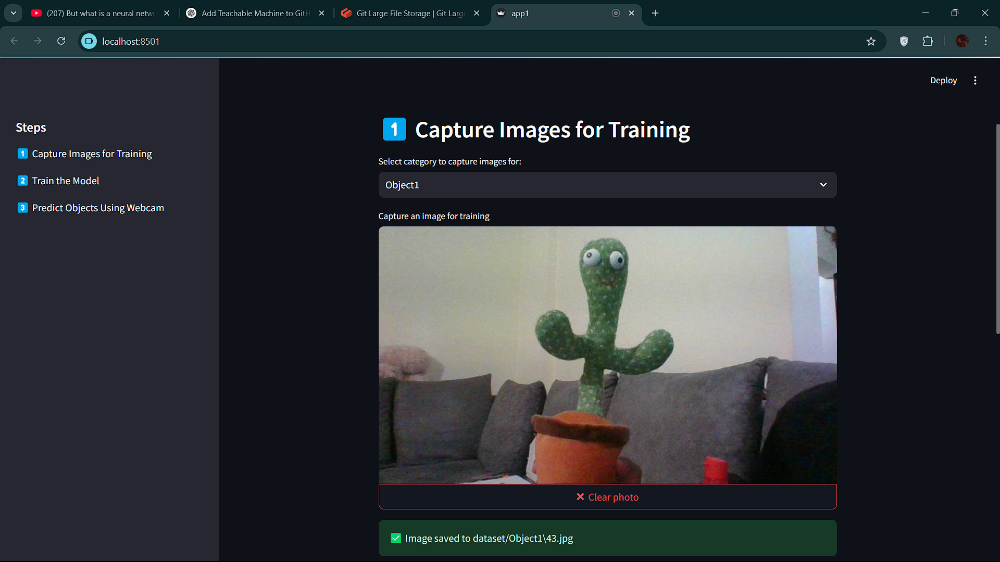
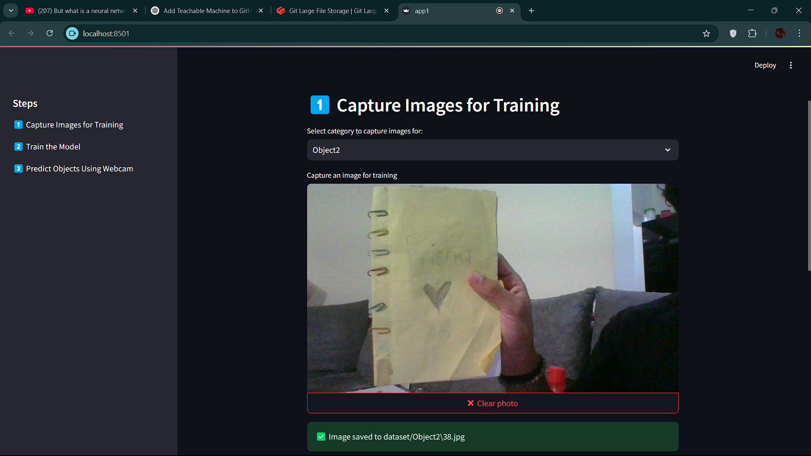
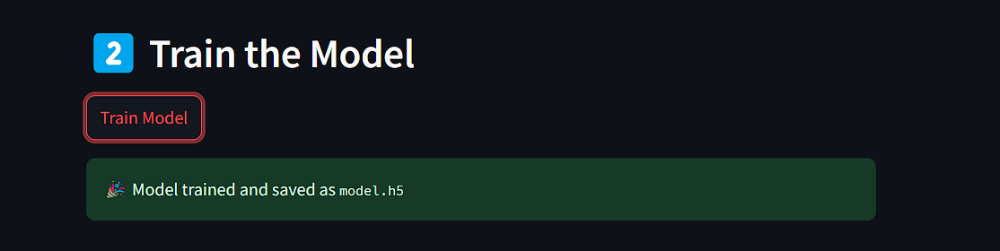
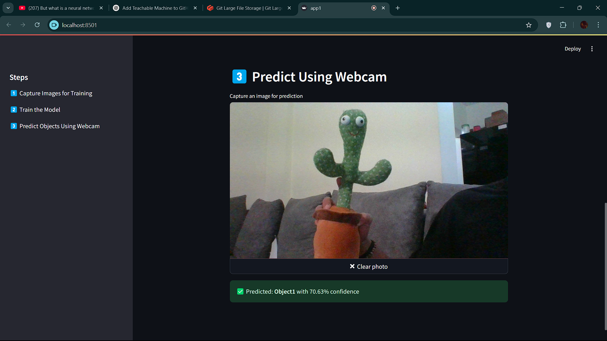

# TeachableMachine-ObjectClassification-Python
Python based Object Classification using Teachable Machine


#  Teachable Machine - Object Classification  

##  Project Overview  
This project is a **Teachable Machine-based Object Classification** application using **Streamlit** and **TensorFlow**.  
It allows users to:  
 Capture images for different object categories  
 Train a deep learning model using Convolutional Neural Networks (CNN)  
 Predict objects using a live webcam feed  

##  Technologies Used  
- **Python** 
- **Streamlit** (for interactive UI)  
- **TensorFlow** (for deep learning model)  
- **PIL (Pillow)** (for image processing)  
- **NumPy** (for handling numerical data)  

## Features  
 **Step 1: Capture Images** - Users can capture images for training the model.  
 **Step 2: Train the Model** - The application trains a CNN model using captured images.  
 **Step 3: Predict Objects** - The model predicts objects using the webcam.  

---

##  Installation & Setup  

###  Step 1: Clone the Repository  
```
git clone https://github.com/ruchiradnaik/TeachableMachine-ObjectClassification-Python

```

### Step 2: Install Dependencies
Make sure you have Python 3.x installed. Then, install the required dependencies

```
pip install streamlit tensorflow pillow numpy
```

### Step 3: Run the Application
Start the Streamlit app using:

```
streamlit run app.py
```

# How It Works

### 1️ Capture Images
Users can select an object category and capture images using their webcam. The images are saved automatically for training.

### 2️ Train the Model
A Convolutional Neural Network (CNN) is trained on the captured images. The model is saved as model.h5 after training.

### 3️ Predict Using Webcam
Users can capture an image, and the trained model will classify it, displaying the predicted category and confidence score.

# Contributing

Contributions are welcome! If you find issues or have improvements, please:

1. Fork the repository

2. Create a feature branch
  ```
   git checkout -b feature-name
```

3. Commit your changes
```
   git commit -m "Added new feature"
```

4. Push to GitHub
  ```
   git push origin feature-name
```
5. Submit a pull request 

## License

This project is licensed under the [MIT License](LICENSE). You are free to use, modify, and distribute this project in accordance with the terms of the license.


## 1) Adding or Capturing an Image as Object 1  

  

## 2) Adding or Capturing an Image as Object 2  

  

## 3) Training the Model  

  

## 4) The Prediction Guessing the Correct Object in Front of the Camera  

  


